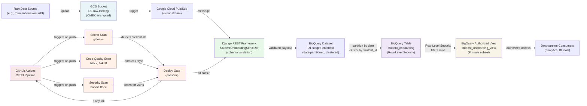

# sushant Marathe / marathesushant862@gmail.com / +91-9307940220

# Architecture Diagram

## Data Flow & CI/CD Gate

## Component Descriptions

### Data Ingestion Pipeline

1. **GCS Bucket (D0-raw-landing)**
   - Stores raw landing data files
   - Encryption: Customer-Managed Encryption Key (CMEK)
   - Versioning: Enabled for data recovery
   - Lifecycle: Auto-transition to Nearline after 30 days, delete after 90 days
   - Access: Restricted to `habot-ingest-dev` service account only

2. **Pub/Sub Topic (event stream)**
   - Decouples data ingestion from validation
   - Allows asynchronous processing
   - Enables scalability without overloading the validation layer

3. **Django REST Framework Serializer**
   - Single source of truth for data shape
   - Validates every payload against the BigQuery schema
   - Rejects any field mismatch, out-of-range value, or invalid type
   - Raises named, specific ValidationError for debugging

4. **BigQuery Dataset (D1-staged-enforced)**
   - Date-partitioned table (`created_at` field)
   - Clustered by `student_id` for query performance
   - Row-Level Security (RLS) restricts rows by IAM principal
   - Authorized View exposes only safe columns (no email, no sensitive fields)

### CI/CD Fail-Closed Gate

The GitHub Actions workflow runs three parallel security gates before allowing deployment:

#### 1. **Lint Job** (`lint`)
   - Runs `black --check` to enforce Python code formatting
   - Runs `flake8` to catch syntax and style errors
   - **Blocks deployment if formatting or style violations found**

#### 2. **Secret Scan Job** (`secret-scan`)
   - Runs `gitleaks detect` on the HEAD commit diff
   - Detects hardcoded API keys, credentials, and secrets
   - **Blocks deployment if any secret pattern is found**
   - Prevents the incident: "junior developer pushed credentials in code"

#### 3. **Security Scan Job** (`security-scan`)
   - Runs `bandit` on Python code to find security issues
   - Runs `tfsec` on Terraform code to find IaC misconfigurations
   - **Blocks deployment if vulnerabilities found**

#### 4. **Deploy Job** (`deploy`)
   - Depends on: `lint`, `secret-scan`, `security-scan`
   - **Only runs if all three upstream jobs succeed**
   - Authenticates to GCP via Workload Identity Federation (no service account key files)
   - Currently a stub (`echo "would deploy"`) — ready for real deployment logic

### Workload Identity Federation (WIF)

GitHub Actions authenticates to GCP without downloading a service account key file:

1. GitHub repo creates a JWT token at runtime
2. Token includes: repo owner, repo name, branch reference
3. GCP validates the JWT against GitHub's OIDC issuer
4. GCP issues a temporary access token (1 hour lifetime)
5. GitHub Actions uses the temporary token for this run only
6. **No permanent credentials ever stored in the repository**

This architecture directly prevents the incident: "credentials leaked in raw application code."

## Why This Design Prevents the Incident

### Unencrypted Credentials
- **Problem**: Junior developer committed `API_KEY = "sk-..."` to the repository.
- **Solution**:
  1. `secret-scan` (gitleaks) scans every commit and rejects it if a credential pattern is found.
  2. `deploy` job has a hard `needs:` dependency on `secret-scan`, so no deployment is possible if secrets are detected.
  3. Workload Identity Federation eliminates the need for static credentials in the first place.

### Database Schema Mismatch
- **Problem**: Developer changed the BigQuery schema without updating the application, breaking downstream analytics.
- **Solution**:
  1. The Django serializer is the single source of truth for the data shape.
  2. Every field has explicit `required`, `max_length`, and `choices` constraints that map 1:1 to the BigQuery schema.
  3. Validation happens before data reaches BigQuery; invalid payloads are rejected at the application layer.
  4. The schema mapping table in `docs/schema-mapping.md` documents the 1:1 relationship for developers to review.

## Security & Compliance Layers

- **At rest**: Data encrypted with CMEK in GCS and BigQuery
- **In transit**: Google-managed encryption (TLS 1.2+)
- **Access control**: Custom IAM roles with minimum permissions per service account
- **Data visibility**: Row-Level Security (RLS) restricts BigQuery rows by principal
- **Authorized view**: Downstream consumers only see non-sensitive columns
- **Audit trail**: Terraform state and BigQuery logs track all changes

